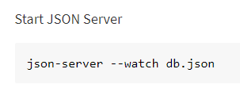
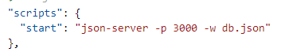

# Demo of a Node project 

## Objectives:
* Explore a Node project which uses JSON-Server as a back-end

## Steps

1. Open the terminal window at the same location as this file. Refer to previous demo README.md if you need additional help.  

1. Open the `package.json` and review its contents. 
    * What is/are the dependencies?
    * What scripts are available?

    ### Install Dependencies

1. Execute the command `npm install`. This will obtain the dependency `json-server` (and its dependencies) and put it into the `node_modules` folder.

    ### Learn about json-server 

1. Look up the description of json-server on the npm website. A quick way to look up packages is to Google search for `npm name-of-package` like **npm json-server**
   
    The results should include the URL: https://www.npmjs.com/package/json-server

2. The website explains how this package will create a Rest API for you from a JSON file. On the website it says you can start using the command shown below. However, if you execute this from the folder, it will not work exactly as written - this is because json-server is inside the node_modules folder.
   
    

3.  By indicating the command through a script property of package.json - we do not have to type out the entire command. When npm is used to run a program, the node_modules directory will be searched for json-server. Note that using -p allows you to set a different port.
   
    

   
    
4.  Execute this script now. You can do this by using the terminal at this same directory as the package.json file.  You could use `npm run start` - or - because start is a common script, you can just use `npm start`.

    ### **Open in Browser**

5. After running the command in the last step - you should see the console display two URLs.
You can ctrl-click these in order to open in the browser:

    http://localhost:3000/bands

    http://localhost:3000/

    ### **Explore the files** 

1. View the files in /public. This is where json-server looks to create the root folder of the site
