# Chapter 1: Lab 1 - Intro

## Objectives

* Practice with markdown files
* Practice with VS Code
* View VS Code extensions

## NOTES

* Throughout the course the terms folder and directory are used interchangeable.
* You may see references to Enter key and Return key. These are the same intention, Enter is usually found on Windows and Return on Macs.

## Links to content below

[Part 1 - Markdown .md files in Edit & Preview Mode](#part-1---markdown-md-files-in-edit--preview-mode)

[Part 2 - The Course Files](#part-2---the-course-files)

[Part 3 - View VS Code extensions](#part-3-view--install-vs-code-extensions)

[Part 4 - Opening Multiple Instances of VS Code](#part-4---opening-multiple-instances-of-vs-code)

[Part 5 - Practice Committing Changes](#part-5---practice-committing-changes)

[Part 6 - Use .gitignore to not track changes](#part-6---using-gitignore-to-ignore-changes)

[Bonus - Explore VS Code](#bonus)

### **Part 1 - Markdown .md files in Edit & Preview Mode**

    We use markdown files in this class as they are used extensively in the industry with modern web projects.  They are plain text files that end in the extension .md and use special characters to indicate the meaning of text and how to display it when used on websites.
    
    On repository sites such as GitHub and Bitbucket a README.md in the root directory describes repositories and how to build and run dynamic projects. If you like to use Reddit you can use markdown to style your posts.
    
    The default mode of VS Code opens .md files in EDIT MODE where you see the special characters for formatting. VS Code also offers a PREVIEW MODE so you can more easily read the styled text.

    We will look at multiple ways to open markdown files in PREVIEW MODE in VS Code. You will use these methods for lab exercises and some demos. 

**Method 1: Using Auto Open Extension**

1. In this class you may have the Auto Open VS Code extension installed. Check under Extensions if you have not confirmed this already. This extension automatically opens all .md files in both edit and preview mode, using split screen - so that you can see the file in both modes.

1. Preview mode is necessary in order to see images. In the line that follows do you see the image? If not you can use the shortcut described next - control+shift+v

    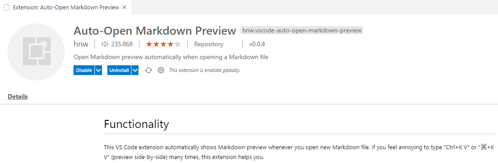

    
    **Method 2: Shortcut CTRL-SHIFT-V**

1. If you are ever viewing a markdown file in edit mode you can use the keyboard top open it in preview mode by hitting **control-shift-V**. This will open the preview in a new tab. You can then switch back and forth using the tabs. 

    **Method 3: OPEN PREVIEW TO SIDE**

1. Close all other tabs so only the README.md is open in Edit Mode. You can do this by right clicking this README.md tab and choosing Close Others. Or by using the Explorer pane to close the group.

    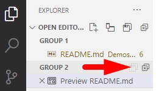
   
    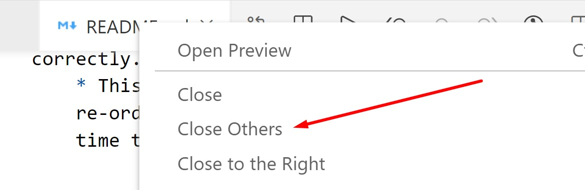

6. When a markdown file is the active file, there is a button that automatically opens Preview in the split pane.
    

        Most everything in VS Code has a hover effect. If you forget what anything does, just hover over it.

**Method 4: OPENING FROM EXPLORER**

1. In VS Code, from the Explorer Pane, you can find the markdown file of interest, right click and choose **Open Preview**. Try this now with this README.md as shown.
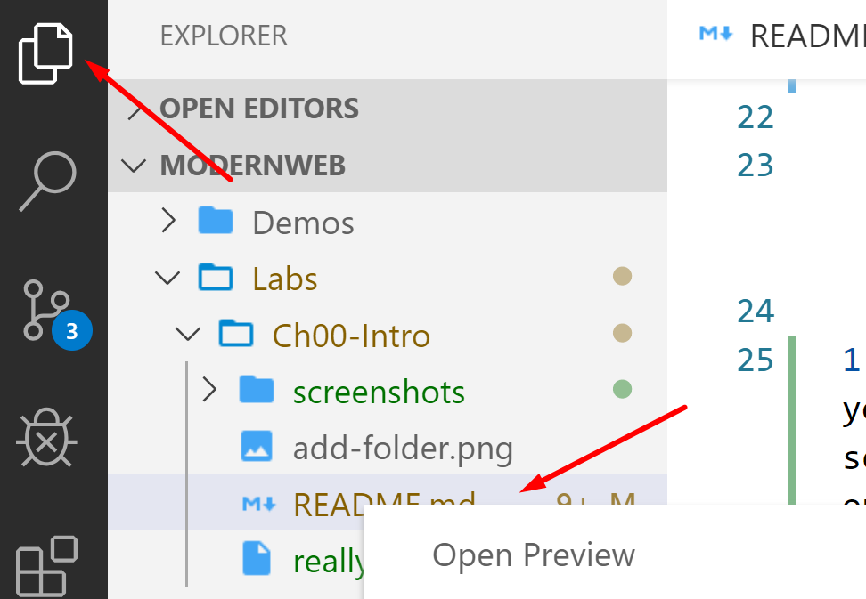

1. In VS Code, while viewing in Preview mode, if you double-click an area of the file, you will be taken back to the EDIT VIEW or "source" markdown file for editing.

    Notice that if you double click the  image shown above - it takes you to the edit mode version where the image is linked.
   
    **OPEN SPLIT SCREEN**

2. Being able to use Split screen is helpful to view two documents at one time. If you are ever not in split screen and want to be, you can do use this icon. 
   
    

3. When you do have split screen open, you can drag tabs between the split screens.
    

        Make sure you are in split screen mode viewing this document in both edit mode and preview mode.  With a markdown file open in both Edit mode and Preview mode, notice that if you scroll in one, the other scrolls as well.
   
  **MARKDOWN FORMATTING**

4. Make sure you can see both the Edit Mode in VS Code and the Preview Mode in VS Code or GitHub while you review the following:

    * Hash marks (#), are used for formatting headings.
        * A single # is heading "level 1" which is biggest, ## is "level 2", slightly smaller, and so on.
    * The asterisk is used to make a bullet.
        * Tabs are used for indentation of bullets.
    * Text can be highlighted using `backticks` around key words.
    * Code can be made **bold** using double asterisks.
    * Every item can be numbered as 1 in Edit Mode. When the markdown file is rendered: in preview mode or in browsers - the numbers will increment correctly.
        * This makes it easy to insert new items or re-order items, without needing to take the time to renumber.

    **VERTICAL MENU BUTTONS TOGGLE**

2. You can give yourself more room to view code by hiding the currently displayed pane. Whichever pane you are on, click that pane's icon in the menu again to toggle the view.  

    

    Practice clicking the Explorer icon a few times to show and hide the Explorer Pane.

   **USING an Online Repo to view markdown files**

3.  There should be a link to the private online repository for this class, such as GitHub. This is shared by the instructor with log in and password. When you click on that link you may need to be logged in or else GitHub etc will show a 404 error.  Try this now and see if you can find/see the formatted markdown.

   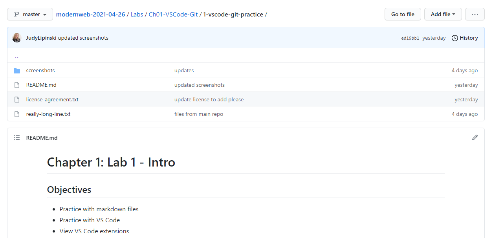

    If you provide a username to the instructor, you can be added to this repository - for use even after class. If you have more than one monitor, this might be helpful to use during class. If so, you may want to open the link to the remote repo to read lab instructions. However, learning to open multiple documents is EXTREMELY important when doing development work and can make things easier for copying and pasting code from reference projects.
   

2.  For the rest of this lab exercise, view this file in Preview mode. 

### **Part 2 - The Course Files**

1. Ensure the Explorer view is visible, listing the files/directories. Recall to click the icon if the view is hidden. 

1. Understanding the directories
    * The `/Cheatsheets` folder has shortcuts and links for what we will be discussing in class.
    * The `/Demos` directory will be used for running demos.
    * The `/Labs` directory will be used for instructions and some libraries for the hands-on exercises you will be doing in class. 

        * It is safe to modify these files, because the Demos and Labs folders are tracked by Git. 
        * If you make and save changes to any of these files, the VS Code source control icon (The Y looking icon in the vertical menu strip) will display a number for each file changed. 
      * 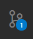
        * You can always revert to the original files by clicking this source control icon, and discarding the changes from one or all files. 
       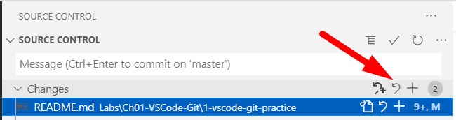

    * The `/PracticeBonusProblems` folder has bonus exercises for HTML, CSS and JS.
    * The `z_update_branch` is a batch script you can use to update your repo with demos done during class.

### **Part 3: View / Install VS Code extensions**

    The extensions pane allows you to search for, install, disable and remove extensions easily.

1. Look on the left side bar menu of VS Code and click on the `Extensions` icon or use the shortcut (Ctrl + Shift + X). 

    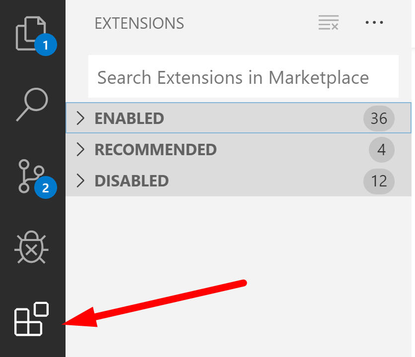

2. Type into the Extensions Marketplace search field to find `VS Code Great Icons` by Emmanual Beziat. If you do not have it already installed click the install button. If you do have it installed, look at how the icons look now in the explorer pane, then search for another extension by typing **icons** and install a new one.  
   
   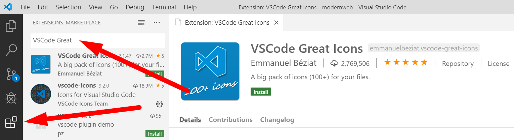

    
3.  Sometimes that is all you do - install. For some extensions there are additional options In this case, icons extsnions will usually prompt you to replace what is being used by VS Code. 
    
    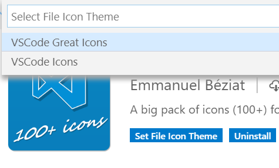

4. Confirm you have the following extensions and if not install them. Read their pages to see what they do. 

* GitLens -Eric Amodio
Git supercharged
* Bracket Pair Colorizer 2 - CoenraadS

### **Part 4 - Opening Multiple Instances of VS Code**

    Quite often you will need to have multiple instances of VS Code open. For example, you may be referring to a sample project and comparing to your own project. In this class, you may wish to have open this course project as well as projects you create on your own. 

    There are multiple options to do this including:
       * Running multiple instances of VS Code 
       * Putting projects in the same folder and opening that folder in VS Code
       * Creating a workspace 

    Whichever method you use, You can use control+c and control+v to copy and paste files and directories between projects.  

#### **Multiple Instances, switch using Windows Task Bar**

  Because you are likely using a Virtual Machine for class, you can use the windows status bar to switch between open VS Code instances by clicking the icon and choosing the one you want. If you are not using a virtual machine, or the VM supports it, you can use Alt+tab to switch.

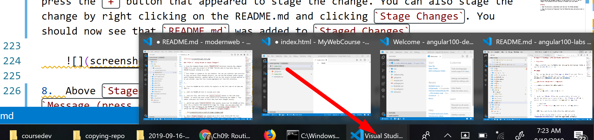

1. If not already open, from the Command Prompt within **c:\repos\MyWebCourse** directory execute the command **code .** to open the project in VS Code. You should now have two instances of VS Code running.

1. In the modern web project find the file **license-agreement.txt** from the same  directory as this README.md. Click to highlight the license-agreement.txt file and hit **Control-C** or right-click to choose **copy** from the context menu.

1. In the root of your **MyWebCourse** folder paste the file using **Control-V** or right-click and choosing paste. If you ever paste into the wrong location, you can always drag and drop the file to where you need it.

### **Part 5 - Practice Committing Changes**

   Because you have added the license file to your **MyWebCourse** folder, you should see the number on the source control icon increased by one. This number indicates the number of files that have been changed locally. If you have a number higher than one you can simply commit all the files using this process.

   Let's practice committing this file following the steps outlined below. 

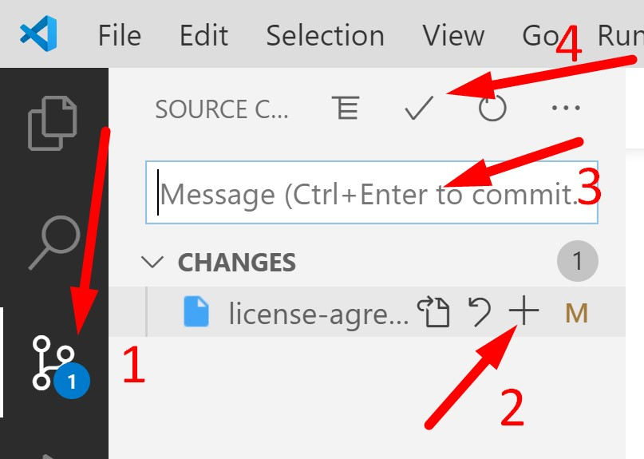

1. Click on the Source Control button to open the panel `Source Control`. 

2. In this panel, mouse over the license file; press the + button that appears to stage the change. (You can also stage the change by right clicking on the file and clicking Stage Changes.)

3.  Above Staged Changes you should see a text input field. Enter a good commit message such as Add license file. You describe the changes being made so that others will be aware, and changed could be reverted if need be later.

4.  Click the check mark above the text message field to commit the changes. The number should then disappear.

### **Part 6 - Using .gitignore to ignore Changes**

    Sometimes, you do not want Git to track certain files or directories. Git looks for a settings file called .gitignore. Any files or directories included in this file will not be tracked.
    
    In Modern Web projects for example, we end up with HUGE node_modules directories which should not be tracked.

1. In your MyWebCourse project, create a file   called **.gitignore**. Notice there is an intentional period (.) proceeding the name of the file.

2. Add this entry on the first line of the file: untracked.text
  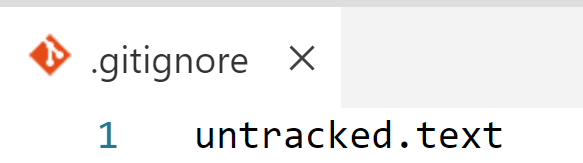 
  
1. Now create a new file called `untracked.text` and inside add the text "This is a local file."
    * Save the file - and you should not see it being tracked by Git - and it should appear in a slightly greyed out font.

1.  Please mark your work as complete. With your name tent card if in a classroom or by using method for online training. (spreadsheet, status symbol, etc.) Then you can move on to the OPTIONAL part or Bonus below.

## Bonus

1. Open the directory **Cheatsheets** and look over the VS Code markdown file in preview mode.
   
2. Open the Interactive Playground from the VS Code Help menu and explore what is possible.
   
3. View GitLens Modifications to Source Control Pane
   1.  On VS Code's left hand toolbar, click on the Source Control ison to open this pane. The GitLens extension provides the additional features marked in red.

    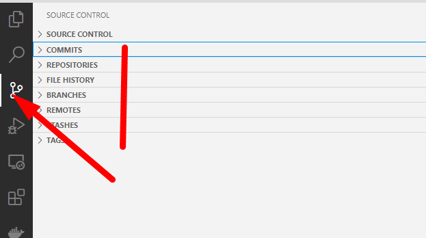

    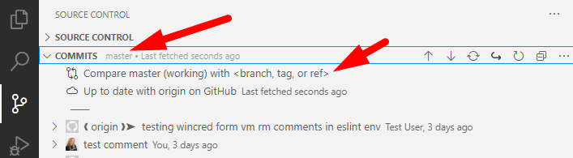

   2.  Familiarize yourself with `GitLens'` panel. Notice how you can use it to access different repositories and their branches, remote, your stashes, etc. Also notice how you can navigate through it to see history of a file, a line, or compare files between different branches or between local and remote.
