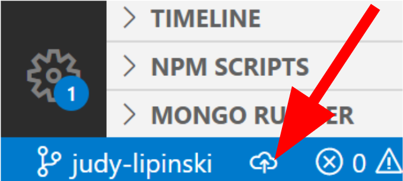
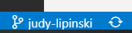
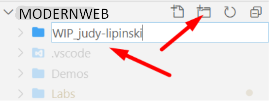
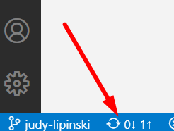

# Chapter 1: Lab 2 - Practice in branch

## Objectives

* Practice in your own branch
* Create WIP directory used during class

## Part 1 - Create a `WIP` directory in your branch

1. Make sure you are looking at the modernweb project with the Explorer pane open.

2. You should see the project name in bold for this course listed. Within this folder you will see the `/Demos` and `/Labs` directories. The name of the folder is what is displayed in bold,  Ex. ModernWeb etc.

2. Make sure you are in your own branch. Your name should be in the bottom left. If you still have a cloud icon, click it to back it up to GitHub. You may be asked to log in. Use the class user pass from your instructor if need be. Then you should see the circular arrows. If you need help, ask your instructor.
   
    

    

    
3. Now create a folder called `WIP_your-name` with your name, to hold your lab work during class. Create this new folder at the same level as `Demos` and `Labs`.

   a. If you hover over the project name you will reveal the menu and can click the new folder icon. Otherwise, in the  empty space at the very bottom of the list, right-click and choose New Folder.
   
   If you create the folder in the wrong place, you can click and drag it to the correct location.
    
    c. Name the new Folder `WIP_` and your name...

    

    ## Part 2 - Commit and push your code

4. As before you will commit your changes. Empty folders cannot be committed in Git. So in your WIP directory, add a file called **myinfo.txt** with your name.
   
5. You should now see a number on the Source Control icon in the menu.

6. Click on the Source Control button to open the panel `Source Control`. 

7. In this panel, enter a commit message such as **Add myinfo.txt**. You describe the changes being made so that others will be aware, and the git log describes what is being done when that commit is applied.

8.  Click the check mark above the text message field to commit the changes. The number should then disappear.
   
9.  In the lower left of VS Code click the circular arrows to push your code to GitHub.

 
