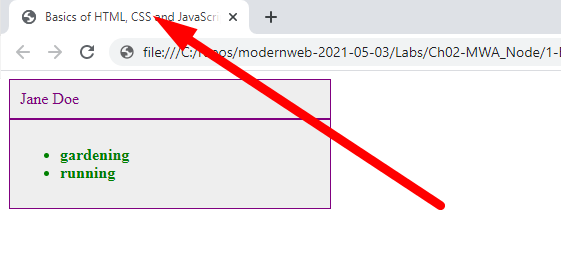
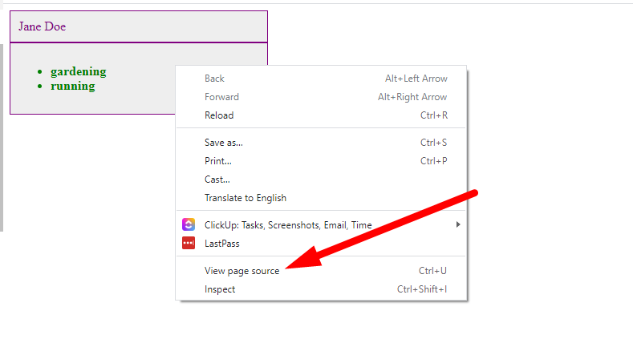
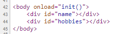
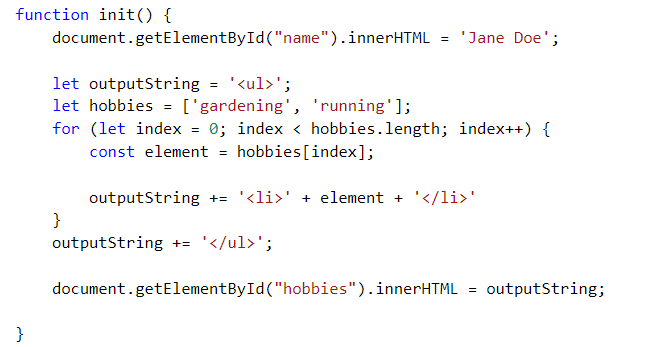

# Chapter 2: Practice with Basics of HTML, CSS, and JS

## Objectives

- View an HTML document with minimal styling and dynamic behavior

## Overview

You will view an html document using VS Code, with basic CSS styling and basic JavaScript usage that manipulates the DOM.

## Steps

### **Open an HTML page with VS Code**

1. Use the **Explorer pane** to look inside the same folder as this **README.md** file. Find the `basics.html` file and click it in the **Explorer pane** to open it in VS Code.

1. Notice in `<head>` there is a `<title>` element that looks like this. When you open this file in the browser we will see this title used in the browser tab.

   ```html
   <title>Basics of HTML, CSS and JavaScript</title>
   ```

1. With the `basics.html` file in focus - you can right click and choose **Open in Browser**. The first time you use **Open in Browser** you will usually be prompted for which browser to set as the default. If you are asked, Choose **Chrome**. Once you have done this once, for the rest of the class you can use **Alt+B** which is the shortcut for Open In Browser.

1. In the browser tab you should be able to see the title being used.

   

1. From within Chrome, right -click on the page and Choose View Page Source.

   

1. You should see that the **body** element, does not have the content that is displayed in the browser. The content is getting there through the use of JavaScript to manipulate the DOM.

   

   ### **View usage of JavaScript**

1. In the **basics.html** file, look for the `<script></script>` tags.

1. This script element contains the following code, which defines a function named **init**. If you are not already familiar with this type of code, the main point of this function is to manipulate the DOM.

   

1. Because the DOM manipulation is for elements with the **id** values of **name** and **hobbies** - we do not wish the function to run until the DOM has loaded these elements into memory by the browser. The HTML file tells the browser to run the function AFTER the DOM is loaded by using the attribute **onload** on the body tag.

   ```html
   <body onload="init()"></body>
   ```

   ### **Viewing styles set with CSS**

1. In the `<head>`, notice the opening and closing `<style>` tags. These are applying styles to the div to have a purple solid border of 1px, with a purple font and grey background color.

   ```html
   <style>
     div {
       width: 300px;
       padding: 10px;
       border: 1px solid purple;
       background-color: grey;
       color: purple;
     }
   </style>
   ```

1. You have finished exploring this file. Mark your work as complete.

1. If you are done before others, continue to the Bonus.

## Bonus

1. Open the Interactive Playground from the VS Code Help menu and explore what is possible.
