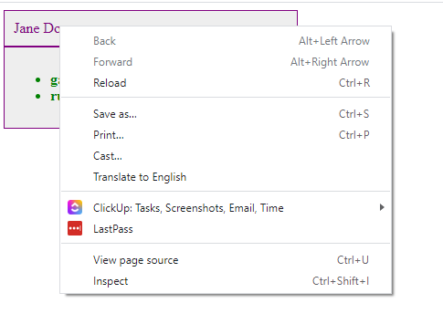
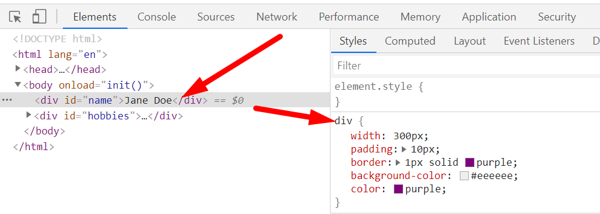
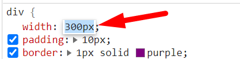
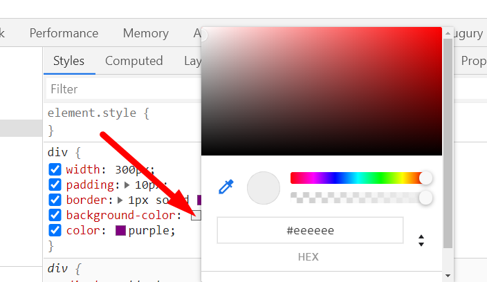
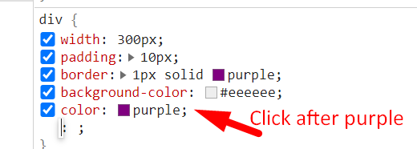
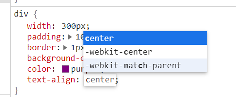

# Chapter 2: DevTools

## Objectives

* Practice with the browser dev tools so that you will be comfortable using dev tools when debugging future coding exercises.

## Steps

1. If you do not have the file still open - open the file `basics.html` from the last directory - in both VS Code and in the Chrome Browser.

    Recall Alt-B from within the file being opened in VS Code, or right-clicking in the VS Code Explorer menu to open in default browser.


1. In Chrome, open the dev tools while looking at the page, by right-clicking on the displayed name in the browser, and choosing Inspect.

    

    This should bring up the tools with the div highlighted in the left side (DOM elements) and the applied CSS on the right.

    

    Besides right-clicking in the browser display, and inspecting - you can also navigate and click on elements in the DOM section of the dev tools. 
    
1. In the CSS, practice changing the width of the box, by:
    * clicking the current value to highlight it
    * hitting the up/down arrows on your keyboard to increment/decrement the value by 1
    * if you hold down the up or down arrow you should see the box change size

    

1. You can also use up and down with keys held down for other increment values. Try holding each of these keys and hitting the up and down arrows.
      
      * alt +/- 0.1
      * shift  +/- 10
      * control +/- 100
  
1. Change the background color:
    * click the color value (#eeeeee) or the square of color - to launch the color picker  - sometimes you may have to click around a bit on the square of color.
    * choose a new color from color picker. you may need to hit return for your changes to stick.

    


2. Let's add a new property to the CSS in the browser. 
   
    * Click on the `value` that is for the last property in the div ruleset (usually `purple` after `color:` )

    

    * Then type to add a text-align property to center the text.
   
    

1. You will see the changes in the browser. When making changes this way - they are not saved to the source file. If you hit reload on the browser what you see reverts to the original source code. Making changes in dev tools gives you a chance to see what it will look like - WYSIWYG - What you see is what you get.  You can then copy values you like back to the source file.

1. Mark your work as complete and continue to the Bonus.

## Bonus:

1. Try being more specific in your CSS so that only the name is centered - not hobbies.
   
1. Use this in the CSS to target the element with the id value of name
    ```CSS
    #name { text-align: center}
    ```

1. Try getting the entire box to be centered on the page.
