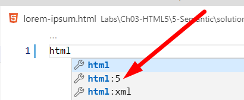

# Chapter 3: Using Semantic Tags

## Objectives
* Add Semantic Tags to a page and content

### Estimated Completion Time 
20 minutes

## Create page and include CSS
 
1. In your WIP folder directory create a new directory called `LoremIpsum`. Inside of this new directory create a new file `lorem-ipsum.html`. 

1. In this file, type html and from the template choose the template with the word `html:5` 

    

2. Notice and make changes:
    * the title tag is highlighted - type Lorem Ipsum.

3. In the HTML file's `<body>` element, create a `<header>` element.

4. In header,  
    * Create an `<h1>` element with the text `Lorem Ipsum Generators`
    * Create an `<h2>` element with the text `let's show some content`

5. After h2, you will add a `<nav>` element and 3 list items with anchors.  To do this dynamically, type this Emmet abbreviation (do not copy) in VS Code. You will be prompted with a dialog box to have it create the lines of code for you.

    ```bat
    nav>ul>li*3>a
    ```

    For now just add the words One, Two and Three to each list item for display.

6. Continue the following steps refreshing the browser when you want to check work that you are doing.

    ## Adding more content

7. After header, add an `<main>` element with the text MAIN AREA 

8. After main, create a footer with this content.

    ```html
    <footer>
            &copy; 2021 - Karmoxie Consulting <a href="mailto:judy@karmoxie.com?subject=CSS%20Exercise">judy@karmoxie.com</a> or <a href="tel:412-353-9161">412-353-9161</a>
    </footer>
    ```

    Offering phone links is helpful for users viewing web documents and laptops connected to phones. Load your page and look at the links. Test the mail link works and say Hello!

## Add Lorem Ipsum text

1. READ: Lorem Ipsum is made up Latin to create placeholders for text when you are creating designs. It is useful when you need to see how paragraphs of text will render.

1. Take only 2-3 minutes for this step:
    * open this website https://loremipsum.io/ultimate-list-of-lorem-ipsum-generators/
    * choose 3 site generators of interest - you will use these to generate content
        *Open them into new browser tabs, right click to open in new tab 
    * interact with these generators. Some have nice features for generating content. 

1. For each generator you chose:
    * create an `<article>` inside of main
    * give it an id value to represent the generator you are assigning
    * create a child h2 element that describes that generator
    * add 3-5 child paragraphs of content from the generator websites
    * add a `<footer>` before the closing article tag with a link to the generator website
        * You can type a, wait and see a drop down to get the basic structure
    

1. Update the nav links in the top of the page to link to each article 

1. You will test your internal links, but may need to add in a lot of content to see any scroll effect. For now, add this code to the `<head>` of your document:
    ```html
    <style>
        p {width:50%}
    </style>
    ```

1. Test your links, you may need to copy a few paragraphs to get an article to start "below the fold" so that you see the page scroll when you click the link for that article.

1. Mark your work as complete.


# Bonus

1. Open the folder PracticeBonusProblems and view the README in 1HTML_CSS_JS. Begin building an app that you can continue to work on during class.

