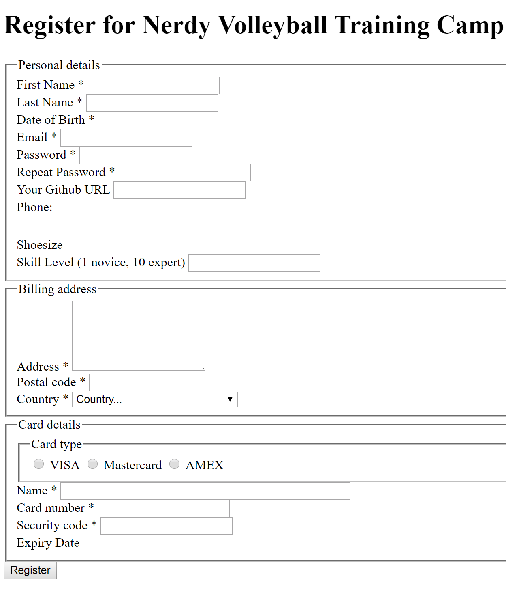

# Chapter 4: Practice with forms

## Objectives

* Create a form

### Estimated Completion Time

15 minutes

1. In your `/html` add a file `vball-register.html`.

1. Open the image `vball-form.png` in this directory. It is also pictured here, but opening the file directly may be easier to see.

   

2. Start to create this form in your new HTML file you created. Use the form elements/ controls discussed so far on the slides, and keep the following in mind:
    * There are many elements, try to at least complete one text field, the card type (radio button) and one fieldset
    * Fieldsets have a legend as the first child element - these visually separate sections of a form
    * Ensure each control has a label, name and id value
    * Don't worry too much about formatting, you can surround labels and controls with div for now

3. Choose an element and add the attribute `title` with a value that describes the field - you can then hover over this in the browser for a tool tip type display.

4. Mark your work as complete

## Bonus

1. HTML4 introduced the tabindex to allow keyboards to be used to tab between elements. Check out this document on using tabindex and other accessibility features:     https://developer.mozilla.org/en-US/docs/Web/Accessibility/Keyboard-navigable_JavaScript_widgets

1. Create a form for adding additional recipes. 
