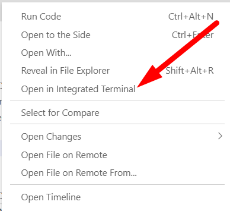

# Chapter 6: JS variables

## Objectives
* Practice with JS variables

### Estimated Completion Time 
10 minutes
 
1. In your current project create a new folder called `js`

1. In `/js` create a file called `variables.js` and do your work in this file.

1. Declare variables x,y,z
    ```javascript
    let x,y,z;
    ```

1. Set the value of x to 10, y to '10' (string) and z to 30
    ```javascript
    x=10;
    y = '10';
    z=30;
    ```

1. Use the `typeof` operator to check the types of each variable, printing the result to the console. Here is the code for x, do this for both x AND y AND z.
    ```javascript
    console.log(`x is ${typeof x}`);
    ```

1. Check your work. First by opening a terminal to the command line. Right-click the file, choose Open in Integrated Terminal

    

1. Then use Node to run your code with this command:

    * use this command: `node variables`
    
2. Now ensure that the VS Code extension called Code Runner is installed (by Jun Han).
    * While looking at your variables.js code in the editor, you can now right-click and choose Run Code 
    * Or, use the shortcut (Ctrl + Alt + N)

3. Add this code to the bottom of the file:
    ```javascript
        var newX = x++;
    ```

4. Print the value using console.log - is it what you expect?

5. Use console.log to see the comparison and the result of x == y. 
    ```javascript
    console.log('The comparison of x==y is:', (x==y))
    ```

## Bonus

1. Use the following code to get the number of milliseconds since epoch. Jan 1, 1970.  
    ``` javascript
    let timeInMs = Date.now();
    ```

1. Using only the operators that we have covered so far, do some rough calculations and use console.log to show:
    * how many seconds since epoch (divide by 1000)
    * how many minutes since epoch (divide by 60)
    * how many days since epoch
    * how many months
    * how many years since epoch  